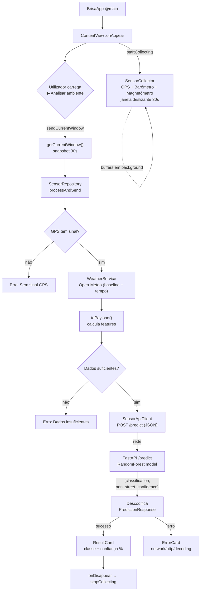

# Fluxo da App — do arranque ao resultado

Diagrama simples do percurso completo: arranque → recolha de sensores →
envio para o backend de ML → classificação → resultado no ecrã.

---

## Visão geral (ASCII)

```
┌──────────────────────────────────────────────────────────────────────┐
│ 1. ARRANQUE                                                            │
│    BrisaApp (@main) ──▶ ContentView aparece (.onAppear)                │
└───────────────────────────────┬──────────────────────────────────────┘
                                 │ viewModel.startCollecting()
                                 ▼
┌──────────────────────────────────────────────────────────────────────┐
│ 2. RECOLHA CONTÍNUA  ·  SensorCollector.startContinuous(30s)          │
│    Buffers em background (janela deslizante de 30s, NSLock):          │
│      • GPS         CLLocationManager   (~1 Hz, sem distanceFilter)    │
│      • Barómetro   CMAltimeter         (~1 Hz)                        │
│      • Magnetómetro CMMotionManager    (10 Hz)                        │
│      • Trim timer  descarta amostras > 2× janela                     │
└───────────────────────────────┬──────────────────────────────────────┘
                                 │  (corre antes de qualquer clique)
                                 ▼
┌──────────────────────────────────────────────────────────────────────┐
│ 3. UTILIZADOR CARREGA  "▶ Analisar ambiente"  ·  ContentView         │
│    viewModel.sendCurrentWindow()  →  estado = .loading (spinner)      │
└───────────────────────────────┬──────────────────────────────────────┘
                                 │ collector.getCurrentWindow()  (snapshot 30s)
                                 ▼
┌──────────────────────────────────────────────────────────────────────┐
│ 4. ORQUESTRAÇÃO  ·  SensorRepository.processAndSend(window)          │
│                                                                       │
│   a) última coord GPS ── sem sinal? ──▶ erro "Sem sinal GPS" ✋       │
│   b) WeatherService.fetch(lat,lon)  ── Open-Meteo                     │
│         └─ falha? usa defaults (1013.25 hPa, "clear") e continua      │
│   c) window.toPayload(baseline, weather)  ── calcula FEATURES         │
│         └─ sem dados? ──▶ erro "Dados insuficientes" ✋               │
└───────────────────────────────┬──────────────────────────────────────┘
                                 │ SensorPayload (JSON, snake_case)
                                 ▼
┌──────────────────────────────────────────────────────────────────────┐
│ 5. ENVIO  ·  SensorApiClient.predictVerticalContext(payload)        │
│    POST {baseURL}/predict   ───────────────────────────────────▶ ╮   │
└──────────────────────────────────────────────────────────────────┼───┘
                                                                    │
              ═══════════════ rede ═══════════════                  │
                                                                    ▼
┌──────────────────────────────────────────────────────────────────────┐
│ 6. BACKEND  ·  FastAPI  /predict  (ml-backend/src/api.py)            │
│    payload ──▶ predict_vertical_context()                            │
│            ──▶ modelo RandomForest (vertical_context_rf.joblib)      │
│    devolve { classification, non_street_confidence }                 │
└───────────────────────────────┬──────────────────────────────────────┘
                                 │ HTTP 200 + JSON
              ═══════════════ rede ═══════════════
                                 ▼
┌──────────────────────────────────────────────────────────────────────┐
│ 7. RECEBIMENTO  ·  SensorApiClient descodifica PredictionResponse   │
│    ── erro? ──▶ networkError / httpError / decodingFailed ✋         │
└───────────────────────────────┬──────────────────────────────────────┘
                                 │
                                 ▼
┌──────────────────────────────────────────────────────────────────────┐
│ 8. RESULTADO NO ECRÃ  ·  SensorViewModel ──▶ ContentView            │
│    sucesso → uploadResult = .success  → ResultCard (classe + conf%)  │
│    erro    → uploadResult = .error    → ErrorCard                    │
│    (@Published → a UI re-renderiza automaticamente)                  │
└──────────────────────────────────────────────────────────────────────┘
                                 │
                                 ▼  (ao sair do ecrã: .onDisappear)
                          stopCollecting()
```

---

## Versão Mermaid (renderiza no GitHub / VS Code)



---

## Notas

- **A recolha começa no `.onAppear`**, antes de qualquer clique — quando o
  utilizador carrega em "Analisar", a janela de 30s já está cheia.
- **A meteorologia nunca bloqueia**: se a Open-Meteo falhar, usa defaults e segue.
- **Pontos de paragem (erro)**: sem sinal GPS, dados insuficientes, falha de
  rede/HTTP, ou descodificação inválida — cada um vira uma mensagem na UI.

> ⚠️ **Desalinhamento de contrato (a confirmar):** o backend
> [`api.py`](../../ml-backend/src/api.py) declara o `SensorWindow` com campos
> `wifi_*`, `ble_*`, `pressure_slope`, `stationary_ratio` — mas o
> [`SensorPayload`](swift/Sources/data/SensorData.swift) do iOS envia
> `gps_speed_*`, `pressure_hpa`, `magnetic_field_*`, etc. Os nomes **não batem
> certo**. Vale a pena alinhar o payload do iOS com o esquema do backend (ou
> vice-versa) antes de testar o envio ponta a ponta.
