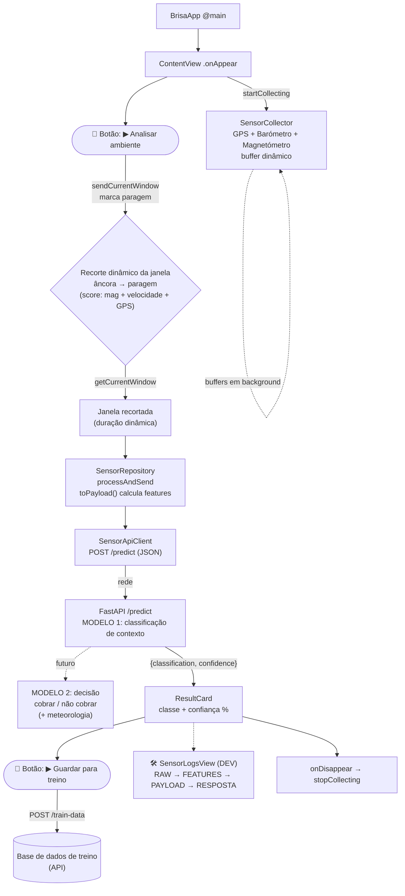

# Fluxo da App — do arranque ao resultado

Diagrama do percurso da solução: arranque → recolha de sensores →
envio para o backend de ML → classificação → resultado no ecrã →
recolha de dados de treino.

> Este documento descreve o **fluxo principal (caminho feliz)**. O tratamento
> de erros (sem sinal GPS, dados insuficientes, falhas de rede) existe no
> código mas foi omitido aqui para manter a visão geral simples.

---

## Visão geral (ASCII)

```
┌──────────────────────────────────────────────────────────────────────┐
│ 1. ARRANQUE                                                            │
│    BrisaApp (@main) ──▶ ContentView aparece (.onAppear)                │
└───────────────────────────────┬──────────────────────────────────────┘
                                 │ viewModel.startCollecting()
                                 ▼
┌──────────────────────────────────────────────────────────────────────┐
│ 2. RECOLHA CONTÍNUA  ·  SensorCollector.startContinuous()            │
│    Buffers em background num BUFFER DINÂMICO (histórico rolling de    │
│    ~minutos, NSLock) — a janela de análise é recortada depois:       │
│      • GPS         CLLocationManager   (~1 Hz, sem distanceFilter)    │
│      • Barómetro   CMAltimeter         (~1 Hz)                        │
│      • Magnetómetro CMMotionManager    (10 Hz)                        │
│      • Trim timer  mantém só o histórico necessário                  │
└───────────────────────────────┬──────────────────────────────────────┘
                                 │  (corre antes de qualquer clique)
                                 ▼
┌──────────────────────────────────────────────────────────────────────┐
│ 3. 🔘 BOTÃO  "▶ Analisar ambiente"  ·  ContentView                   │
│    O utilizador carrega ──▶ marca o instante de referência (paragem) │
│    viewModel.sendCurrentWindow()  →  estado = .loading (spinner)      │
└───────────────────────────────┬──────────────────────────────────────┘
                                 ▼
┌──────────────────────────────────────────────────────────────────────┐
│ 3b. RECORTE DINÂMICO DA JANELA  ·  (estratégia de âncora)            │
│    Recua no buffer a partir da paragem e corta a janela:             │
│      âncora ──────────────────────▶ paragem                          │
│    Âncora achada por um SCORE DE VARIAÇÃO                            │
│    (magnetómetro + redução de velocidade + perda de GPS).           │
│    → duração da janela é DINÂMICA, não fixa.  [detalhe à parte]      │
└───────────────────────────────┬──────────────────────────────────────┘
                                 │ janela recortada (âncora → paragem)
                                 ▼
┌──────────────────────────────────────────────────────────────────────┐
│ 4. ORQUESTRAÇÃO  ·  SensorRepository.processAndSend(window)          │
│    window.toPayload()  ──▶ calcula FEATURES                          │
│    constrói SensorPayload (JSON, snake_case)                         │
│                                                                       │
│    [futuro] WeatherService injecta baseline + condição do tempo      │
└───────────────────────────────┬──────────────────────────────────────┘
                                 │ SensorPayload
                                 ▼
┌──────────────────────────────────────────────────────────────────────┐
│ 5. ENVIO  ·  SensorApiClient.predictVerticalContext(payload)        │
│    POST {baseURL}/predict   ───────────────────────────────────▶ ╮   │
└──────────────────────────────────────────────────────────────────┼───┘
                                                                    │
              ═══════════════ rede ═══════════════                  │
                                                                    ▼
┌──────────────────────────────────────────────────────────────────────┐
│ 6. BACKEND  ·  FastAPI  /predict                                     │
│    payload ──▶ MODELO 1: classificação de contexto vertical          │
│            (estrutura / piso / garagem vs. via pública)              │
│                                                                       │
│    [futuro] MODELO 2: decisão final — COBRAR ou NÃO COBRAR           │
│            (recebe a classificação + dados meteorológicos)           │
│    devolve { classification, confidence }                            │
└───────────────────────────────┬──────────────────────────────────────┘
                                 │ HTTP 200 + JSON
              ═══════════════ rede ═══════════════
                                 ▼
┌──────────────────────────────────────────────────────────────────────┐
│ 7. RESULTADO NO ECRÃ  ·  SensorViewModel ──▶ ContentView            │
│    uploadResult = .success  →  ResultCard (classe + confiança %)     │
│    (@Published → a UI re-renderiza automaticamente)                  │
└───────────────────────────────┬──────────────────────────────────────┘
                                 │
                                 ▼
┌──────────────────────────────────────────────────────────────────────┐
│ 8. 🔘 BOTÃO  "▶ Guardar para treino"  ·  ContentView                 │
│    Aparece DEPOIS da classificação.                                  │
│    Envia o payload + a resposta do modelo para a API:               │
│      POST {baseURL}/train-data                                       │
│    → alimenta a base de dados de exemplos para retreinar o modelo.   │
└───────────────────────────────┬──────────────────────────────────────┘
                                 │
                                 ▼
┌──────────────────────────────────────────────────────────────────────┐
│ 🛠  TELA DE LOGS (DEV)  ·  SensorLogsView                            │
│    Todo o pipeline fica visível: RAW → FEATURES → PAYLOAD →          │
│    RESPOSTA DO MODELO → (futuro) decisão cobrar/não + meteorologia.  │
└──────────────────────────────────────────────────────────────────────┘
                                 │
                                 ▼  (ao sair do ecrã: .onDisappear)
                          stopCollecting()
```

---

## Versão Mermaid (renderiza no GitHub / VS Code)



---

## Notas

- **A recolha começa no `.onAppear`**, antes de qualquer clique — o buffer vai
  acumulando histórico para haver passado suficiente onde recortar.
- **A janela não é fixa:** é um **buffer dinâmico**. O clique no botão marca o
  instante de **paragem**; a janela de análise é recortada recuando no buffer
  até à **âncora** (início da transição), achada por um **score de variação**
  (magnetómetro + redução de velocidade + perda de GPS). _A estratégia da
  âncora está definida à parte — aqui só entra como passo do fluxo._
- **Dois modelos no backend (objetivo final):**
  - **Modelo 1 — classificação de contexto vertical** (já em uso): diz se o
    veículo está em via pública ou em estrutura/piso/garagem.
  - **Modelo 2 — decisão de cobrança** _(futuro)_: recebe a classificação do
    modelo 1 **+ dados meteorológicos** (via WeatherService) e decide
    **cobrar ou não cobrar**.
- **WeatherService** _(futuro)_: entra no fim do pipeline para alimentar o
  modelo 2 com a condição do tempo / pressão baseline. Por agora está fora do
  caminho principal.
- **Botão "Guardar para treino"** _(novo)_: aparece **depois** da classificação.
  Envia o payload original + a resposta do modelo para a API
  (`POST /train-data`), construindo a base de dados de exemplos usada para
  **retreinar o modelo**.
- **Tela de logs (DEV):** todo o pipeline fica visível — leituras brutas,
  features extraídas, payload enviado, resposta do modelo e (no objetivo final)
  a decisão de cobrança e os dados meteorológicos.
